# 🏦 E-Wallet — Billetera Digital con Django

## 📌 Descripción del Proyecto

E-Wallet es una aplicación web desarrollada con Django que simula el funcionamiento de una billetera digital (fintech), permitiendo a los usuarios gestionar sus transacciones financieras de manera segura, estructurada y controlada.

La aplicación permite registrar depósitos, retiros, visualizar el saldo en tiempo real y administrar configuraciones asociadas a la cuenta del usuario.

---

## 🎯 Objetivo

El objetivo de este proyecto es implementar una aplicación web completa utilizando Django, aplicando:

- Modelado de datos relacional
- Uso del ORM de Django
- Implementación de operaciones CRUD
- Construcción de vistas y templates personalizados
- Filtros dinámicos de información

Todo esto alineado con los requerimientos del módulo de **Acceso a Datos con Django**.

---

## 🚀 Enfoque del Proyecto

A diferencia de una implementación básica, este proyecto incorpora conceptos utilizados en aplicaciones fintech reales:

- ❌ No eliminación de transacciones (se utilizan reversas)
- 💰 Saldo calculado dinámicamente (no persistido)
- 🔒 Validaciones de negocio (ej: control de saldo en retiros)
- 👤 Multiusuario con aislamiento por sesión (`request.user`)
- ⚙️ Arquitectura desacoplada usando `services.py`

Esto permite simular un entorno más cercano a una aplicación productiva real.

---

## 🧩 Modelo de Datos

La aplicación fue diseñada utilizando un modelo relacional que representa los componentes principales de una billetera digital.

### 📌 Modelos implementados

---

### 👤 Usuario (`User`)
Se utiliza el modelo nativo de Django para gestionar autenticación y datos básicos del usuario.

---

### 💼 Wallet

Representa la billetera digital de cada usuario.

**Campos principales:**
- `user` → Relación OneToOne con `User`
- `is_active` → Indica si la billetera está habilitada
- `created_at`, `updated_at` → Trazabilidad

**Justificación:**
Cada usuario posee una única billetera, lo que se modela mediante una relación `OneToOneField`.

---

### 🔄 TransactionType

Define los tipos de transacciones disponibles en el sistema.

**Campos principales:**
- `code` → Identificador técnico (`deposit`, `withdraw`)
- `name` → Nombre visible
- `description` → Descripción opcional

**Justificación:**
Permite desacoplar la lógica de negocio de los textos visibles, facilitando escalabilidad y mantenimiento.

---

### 💸 Transaction

Representa cada movimiento financiero dentro de una billetera.

**Campos principales:**
- `wallet` → Relación `ForeignKey` con `Wallet`
- `transaction_type` → Relación `ForeignKey` con `TransactionType`
- `amount` → Monto de la transacción
- `description` → Detalle opcional
- `timestamp` → Fecha de creación automática

---

## 🔗 Relaciones entre modelos

- Un **Usuario** tiene una **Wallet** → `OneToOneField`
- Una **Wallet** tiene muchas **Transactions** → `ForeignKey`
- Cada **Transaction** tiene un **TransactionType** → `ForeignKey`

---

## ⚙️ Decisiones de diseño

### 🔒 Uso de `on_delete`

- `Wallet → User`: `CASCADE`
  - Si se elimina el usuario, se elimina su billetera

- `Transaction → Wallet`: `CASCADE`
  - Si se elimina la billetera, se eliminan sus transacciones

- `Transaction → TransactionType`: `PROTECT`
  - No se permite eliminar un tipo si tiene transacciones asociadas

**Justificación:**
Se protege la integridad histórica de los datos financieros.

---

## 💰 Cálculo de saldo

El saldo **no se almacena en la base de datos**, sino que se calcula dinámicamente:

- Suma de depósitos
- Menos suma de retiros

**Justificación:**
Evita inconsistencias y asegura que el saldo siempre refleje el estado real de las transacciones.

---

## 🔄 Operaciones CRUD y uso del ORM

La aplicación implementa completamente las operaciones CRUD utilizando vistas personalizadas y el ORM de Django, sin depender del panel administrativo.

---

## ➕ CREATE (Crear)

Permite registrar nuevas transacciones desde un formulario en la interfaz web.

**Flujo:**
1. El usuario completa el formulario
2. La vista recibe los datos (`POST`)
3. Se valida el formulario
4. Se crea la instancia usando el ORM
5. Se guarda en la base de datos

**Métodos ORM utilizados:**
- `.save()`
- `.get_or_create()`

---

## 👁️ READ (Leer)

### 📋 Listado de transacciones
Se muestran todas las transacciones del usuario autenticado.

**Métodos ORM utilizados:**
- `.filter()`
- `.select_related()`
- `.order_by()`

---

### 🔍 Detalle de transacción
Permite visualizar la información específica de una transacción.

**Métodos ORM utilizados:**
- `.get()`

---

## ✏️ UPDATE (Actualizar)

Permite editar una transacción existente (limitado a la descripción).

**Flujo:**
1. Se carga el formulario con datos existentes
2. El usuario modifica la información
3. Se valida y guarda usando el ORM

**Restricción de negocio:**
- No se permite modificar el monto ni el tipo de transacción

**Métodos ORM utilizados:**
- `.save()`

---

## 🗑️ DELETE (Eliminar)

La eliminación se implementa sobre el modelo `TransactionType`.

**Flujo:**
1. El usuario solicita eliminar un tipo
2. Se ejecuta `.delete()`
3. Si existen relaciones, se bloquea mediante `PROTECT`

**Métodos ORM utilizados:**
- `.delete()`

**Nota:**
Las transacciones no se eliminan por diseño, sino que se revierten mediante nuevas transacciones.

---

## 🔍 Filtros y búsqueda (Paso obligatorio)

Se implementa un sistema de filtrado dinámico en el listado de transacciones.

**Criterios disponibles:**
- Tipo de transacción
- Monto mínimo
- Búsqueda por texto (descripción o tipo)

**Métodos ORM utilizados:**
- `.filter()`
- `Q()`

---

## 📌 Diferencia entre `.get()` y `.filter()`

- `.get()`:
  - Retorna un único objeto
  - Lanza error si no existe o hay más de uno
  - Se utiliza para obtener un registro específico

- `.filter()`:
  - Retorna un conjunto de resultados (QuerySet)
  - No lanza error si no hay coincidencias
  - Se utiliza para búsquedas y listados

---

## 🗃️ Migraciones

Las migraciones en Django permiten transformar los modelos definidos en Python en tablas reales dentro de la base de datos.

### 📌 ¿Qué ocurre si se modifica un modelo sin generar migración?

Si se cambia un modelo y no se ejecuta una nueva migración:
- La base de datos no se actualiza
- Se genera inconsistencia entre el código y el esquema
- Pueden ocurrir errores en tiempo de ejecución

---

### 📁 ¿Dónde se almacenan las migraciones?

Las migraciones se almacenan en la carpeta:

```
wallet/migrations/
```

---

Cada archivo contiene instrucciones que Django utiliza para crear o modificar tablas.

---

## 🧱 Arquitectura del Proyecto

El proyecto sigue el patrón MTV (Model - Template - View) de Django.

### 🔹 Model
Define la estructura de datos y la lógica asociada.

### 🔹 View
Gestiona la lógica de negocio y el flujo de datos.

### 🔹 Template
Se encarga de la presentación en el navegador.

---

### 📌 Separación de responsabilidades

Se respeta la arquitectura evitando lógica en los templates.

- La lógica de base de datos se encuentra en las vistas
- Las validaciones están centralizadas en modelos y formularios
- Los templates solo renderizan información

---

## 🔄 Flujo de una solicitud en Django

1. El usuario accede a una URL
2. Django evalúa `urls.py`
3. Se ejecuta la vista correspondiente
4. La vista interactúa con el ORM
5. Se obtienen o modifican datos en la base de datos
6. Se envía un contexto al template
7. El template renderiza la información
8. El navegador muestra el resultado al usuario

---

## 🧠 Consideraciones adicionales del diseño

- Se implementa aislamiento de datos por usuario utilizando `request.user`
- Se utilizan validaciones para evitar inconsistencias (ej: saldo insuficiente)
- Se prioriza la integridad de los datos financieros sobre la eliminación directa

Esto permite una aplicación más robusta y cercana a escenarios reales.

---

## ▶️ Ejecución del Proyecto

Para ejecutar la aplicación localmente:

```bash
python manage.py runserver
```

Luego abrir en el navegador:
```bash
http://127.0.0.1:8000/
```

## 🌐 Acceso al Sistema

### 👤 Usuarios de prueba

Se han creado dos usuarios predeterminados para facilitar las pruebas:

1. **Usuario 1**:
   - Usuario: `user1`
   - Contraseña: `password123`

2. **Usuario 2**:
   - Usuario: `user2`
   - Contraseña: `password123`

### 🔑 Credenciales de administrador

- Usuario: `admin`
- Contraseña: `admin123`

---

## 📸 Evidencia de funcionamiento

A continuación se presentan capturas de pantalla que evidencian el funcionamiento del sistema:

### 🖥️ Ejecución del servidor

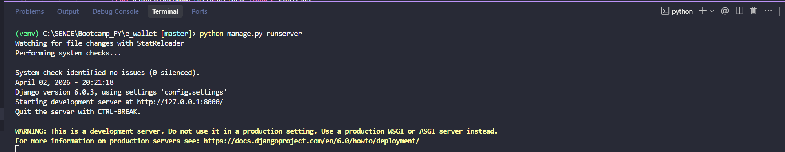

### 🌐 Interfaz de la aplicación

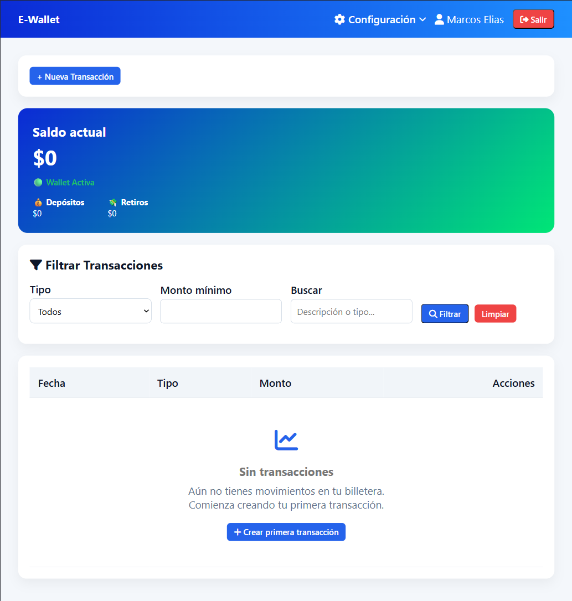

### ➕ Creación de transacción

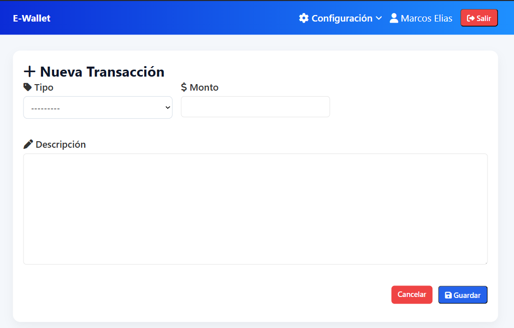

### 🔍 Listado y filtros

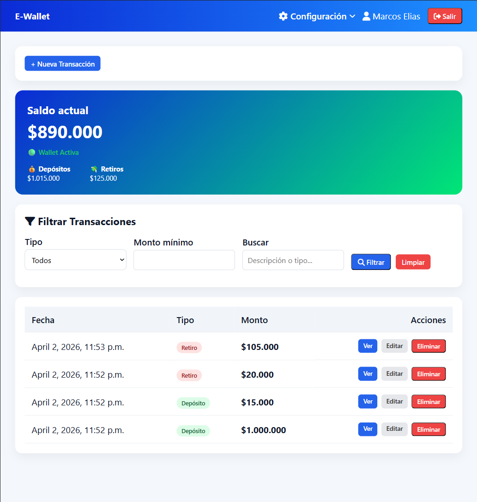


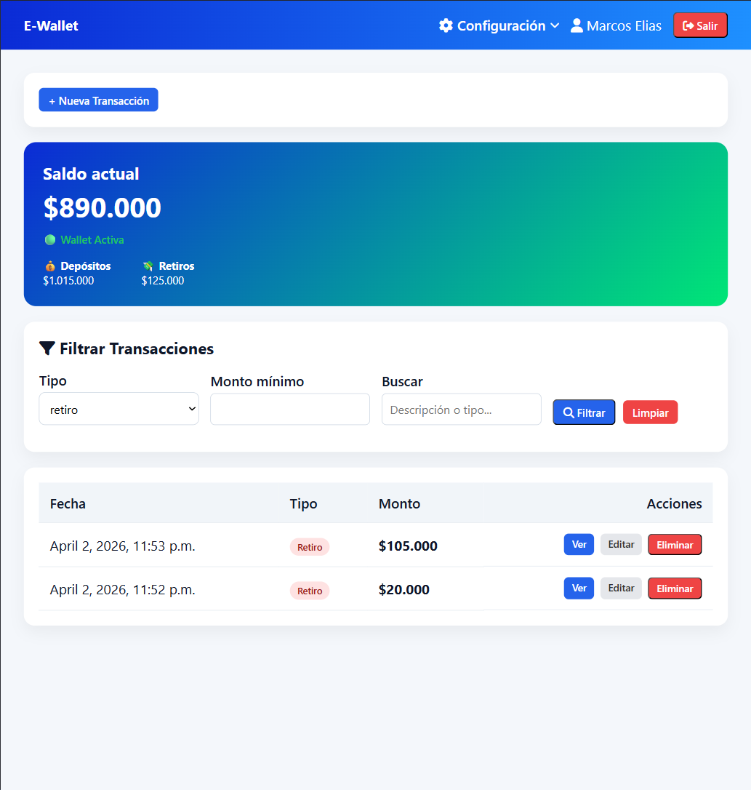

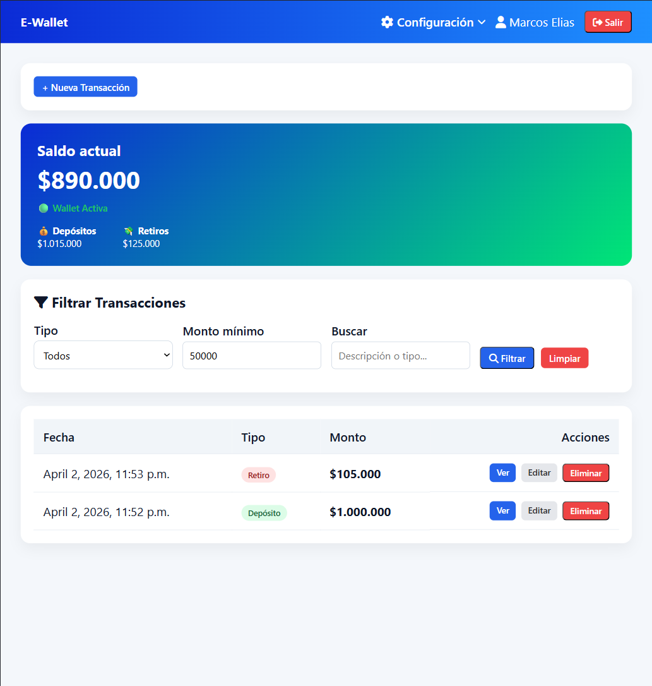

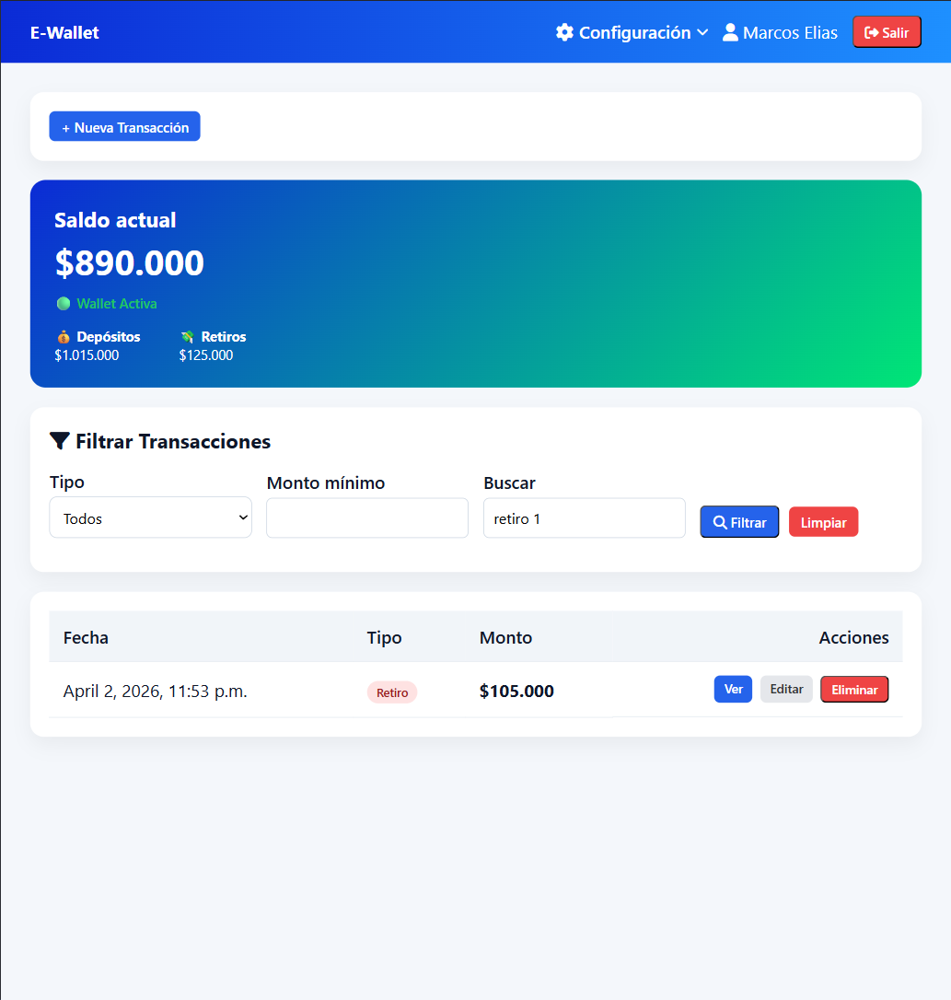

### ✏️ Edición de transacción

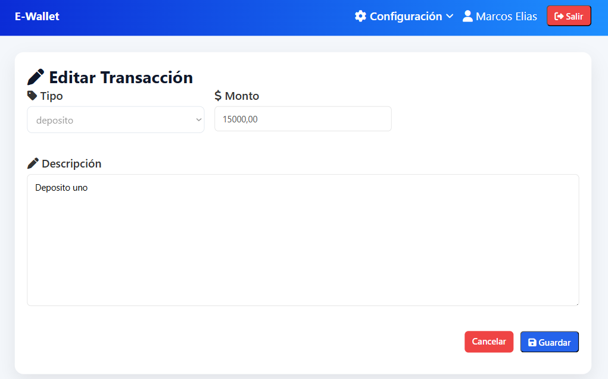

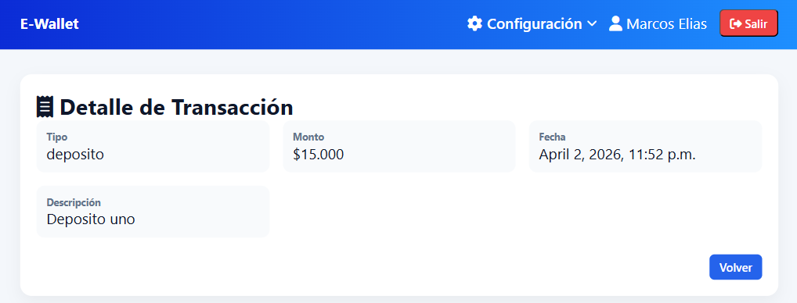

### 🗑️ Eliminación de tipo de transacción

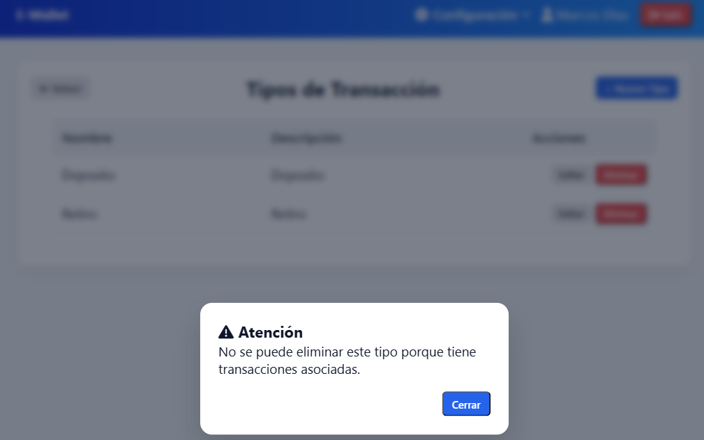

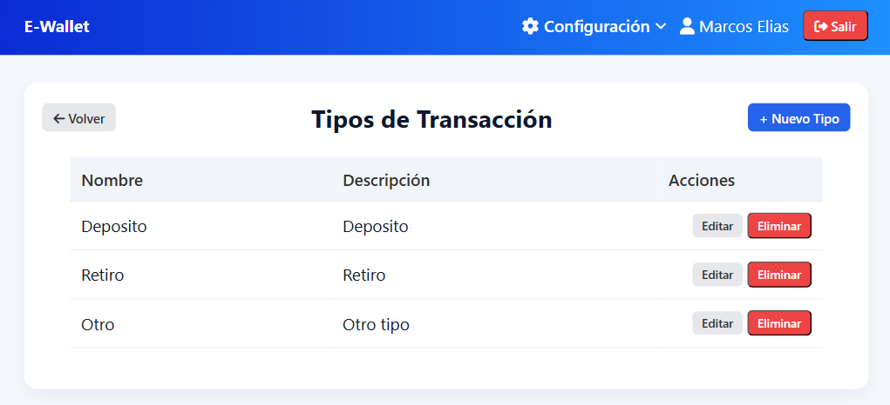

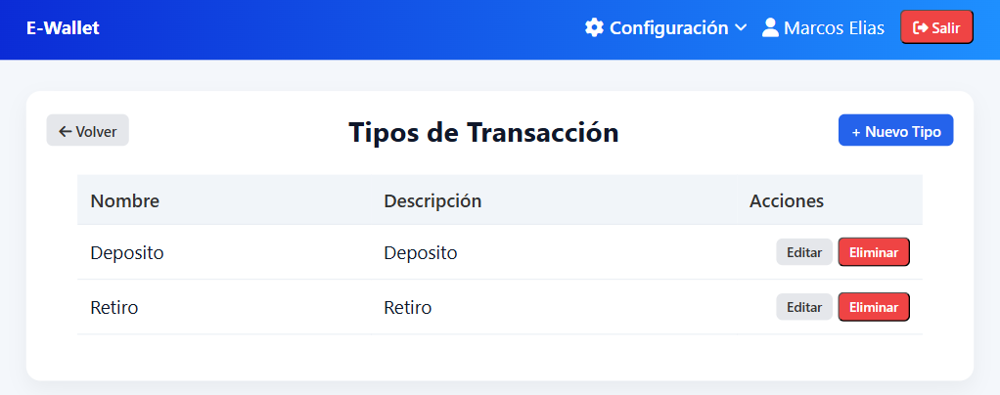

## 🧾 Conclusión

El proyecto cumple con todos los requerimientos establecidos en la pauta del módulo, implementando correctamente:

- Modelado de datos relacional
- Uso del ORM de Django
- Operaciones CRUD completas desde templates
- Sistema de filtrado dinámico
- Arquitectura basada en el patrón MTV

---

## 🚀 Valor agregado

Además de cumplir con la pauta, el proyecto incorpora mejoras orientadas a escenarios reales:

- 🔁 Reversa de transacciones en lugar de eliminación
- 💰 Cálculo dinámico del saldo
- 🔒 Validaciones de negocio robustas
- 👤 Aislamiento de datos por usuario
- ⚙️ Separación de lógica mediante capa de servicios

---

### ⚡ Optimización de consultas en el Admin

Se implementó una optimización en el panel de administración de Django para el cálculo del saldo de las billeteras.

En lugar de calcular el saldo por cada registro (lo que genera múltiples consultas a la base de datos), se utilizó `annotate()` junto con funciones de agregación (`Sum`, `Case`, `When`, `Coalesce`) para calcular los totales directamente a nivel de consulta.

**Beneficios:**
- Reduce significativamente la cantidad de queries (evita el problema N+1)
- Mejora el rendimiento del sistema
- Escala de forma eficiente con mayor volumen de datos

**Resultado:**
El saldo se calcula en una sola consulta SQL, manteniendo eficiencia y consistencia.

---

## 📌 Consideraciones finales

Este proyecto no solo cumple con los objetivos académicos del módulo, sino que también refleja buenas prácticas de desarrollo aplicadas a sistemas financieros, priorizando la integridad de los datos y la experiencia de usuario.

---

## 👥 Autores

- Marcos Elias - Desarrollador

---

## 📄 Licencia

Este proyecto es de código cerrado y está destinado únicamente para fines educativos y de evaluación.